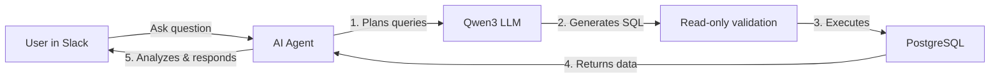
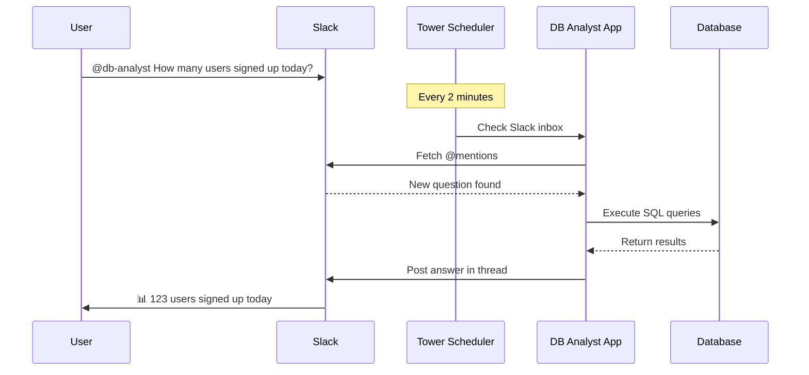
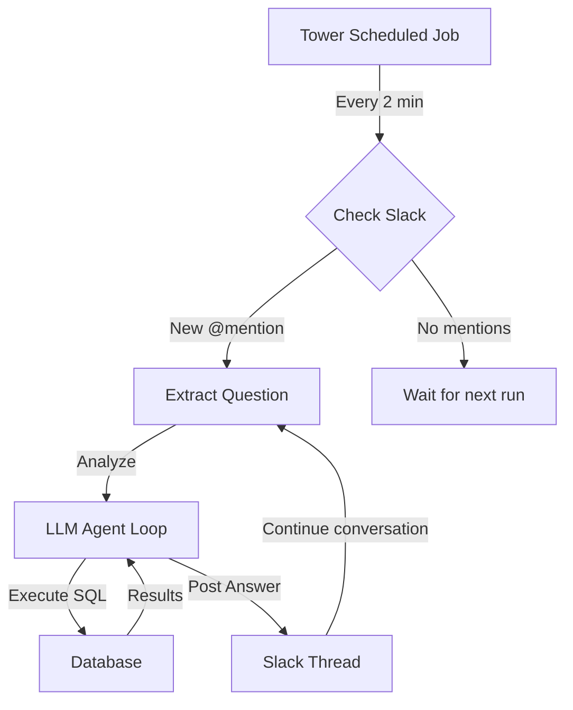
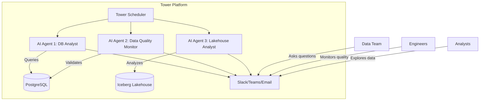

# 🔍 DB Analyst: Natural Language Database Access

## The Problem

**As an engineer debugging a production issue, I couldn't access the data I needed.**

### Common Barriers:
- 🔒 **Security** - Direct DB access restricted (compliance, security policies)
- 🛠️ **Technical Gap** - Non-technical stakeholders can't write SQL
- ⏱️ **Slow Process** - Request → Wait for data team → Get CSV → Analyze
- 🚫 **Limited Tools** - BI dashboards don't answer ad-hoc questions

### Real Scenario:
```
Engineer: "Why did user signups drop yesterday?"
❌ Can't connect to production DB
❌ Can't wait 2 hours for data team
❌ Dashboard doesn't have that view
```

---

## The Solution: AI Database Analyst

### Natural Language → SQL → Insights



### Key Features:
✅ **Safe** - Read-only query validation
✅ **Interactive** - Slack bot with threading
✅ **Smart** - Multi-turn conversations with tool calling
✅ **Fast** - Answers in seconds, not hours

---

# 🏗️ Tower Platform Features Used

## 1. **Tower LLM SDK** (`tower.llms()`)

```python
llm = tower.llms("Qwen/Qwen3-Coder-30B-A3B-Instruct")
response = llm.complete_chat(messages, tools=tools)
```

- 🔄 **Unified API** - Works with HuggingFace, Ollama, AWS Bedrock
- 🛠️ **Tool Calling** - Agent autonomously executes SQL queries
- 🔧 **Flexible** - Easy to swap LLM providers

---

## 2. **Tower Scheduling**

```toml
[app]
schedule = '0 */2 * * * *'  # Every 2 minutes
```



**Runs continuously** - Checks Slack for @mentions automatically

---

## 3. **Two Modes of Operation**

### Mode 1: One-Shot Analysis
```bash
tower run --parameter=user_question='What tables exist?'
```
Direct CLI execution for immediate answers

### Mode 2: Slack Inbox (Scheduled)
```bash
# Runs every 2 minutes via Tower scheduling
tower run  # No question parameter
```



---

# 🚀 Future: AI Agents on Tower

## Beyond SQL - Analytical Use Cases



---

## Tower + Iceberg: Next Level Analytics

```python
# Current: PostgreSQL queries
llm = tower.llms("qwen3-coder")
llm.complete_chat(messages, tools=[execute_sql_query])

# Future: Iceberg lakehouse queries
tables = tower.tables("user_events", namespace="analytics")
llm.complete_chat(messages, tools=[query_lakehouse])
```

### Use Cases:
📊 **Analytics Agents** - Query petabyte-scale data lakes
🔍 **Data Discovery** - Auto-generate insights from lakehouse
📈 **Metric Monitoring** - Proactive anomaly detection
🤖 **Multi-Agent Systems** - Coordinated analytical workflows

---

## Why Tower for AI Agents?

### ✅ **Built for Data Workloads**
- Native Iceberg support
- PostgreSQL, S3, data warehouses
- Secrets management

### ✅ **Scheduling & Orchestration**
- Cron-based execution
- Event-driven triggers
- Reliable, scalable infrastructure

### ✅ **Developer Experience**
- Simple Python SDK
- Local development → Cloud deployment
- Version control friendly (Towerfile)

### ✅ **Production Ready**
- Logging, monitoring
- Secrets management
- Team collaboration

---

# 🎯 Demo Time!

## Live Interaction

1. **@mention the bot** in Slack
2. **Ask a question** in natural language
3. **Watch it think** (⏳ reaction)
4. **Get instant answers** with SQL queries shown
5. **Continue the conversation** in threads

```
You: @db-analyst What tables exist in the database?

Bot: 📊 Database Analysis Complete

     Answer: I found 5 tables in your database:
     1. users (1,234 rows)
     2. orders (5,678 rows)
     3. products (234 rows)
     4. payments (5,432 rows)
     5. logs (45,678 rows)

     Queries Executed (1):
     • SELECT table_name, COUNT(*) FROM information_schema.tables...
```

---

# Thank You! 🙏

## Repository
📦 `tower-examples/xx-db-analyst`

## Key Takeaways
1. 🔐 **Secure data access** for everyone
2. 🤖 **AI agents** on Tower platform
3. 📊 **Interactive analytics** via Slack
4. 🚀 **Future**: Lakehouse + AI agents at scale

## Questions?

**Built with:**
- 🏗️ Tower Platform
- 🧠 Qwen3-Coder-30B (HuggingFace)
- 💬 Slack SDK
- 🗄️ PostgreSQL
